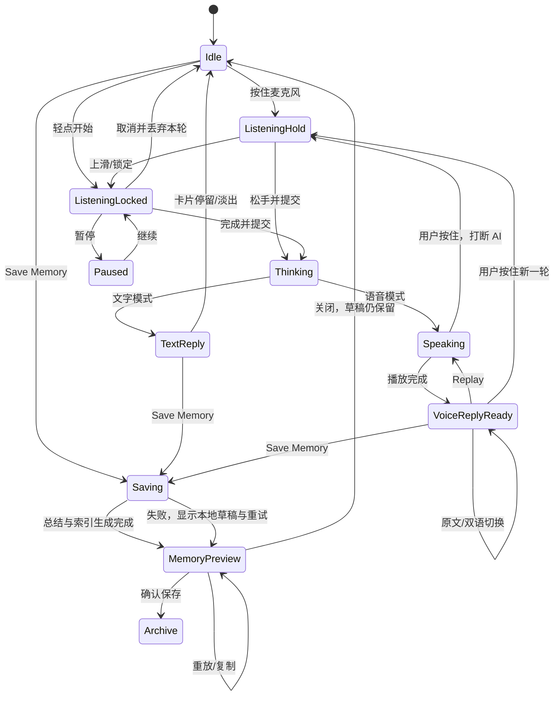
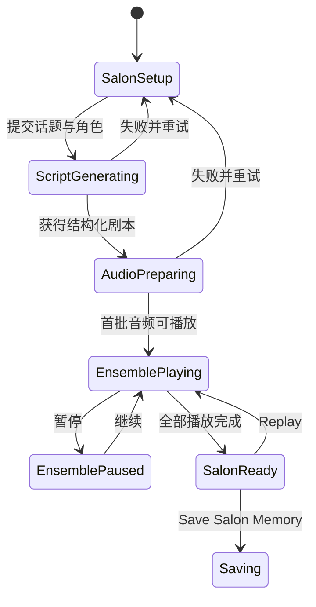
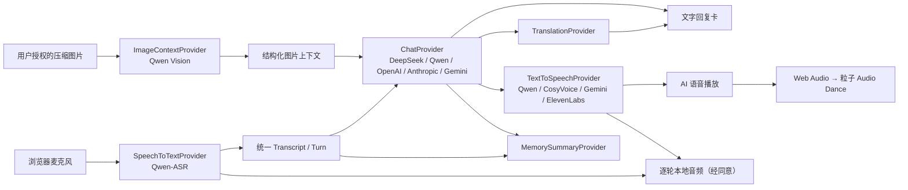
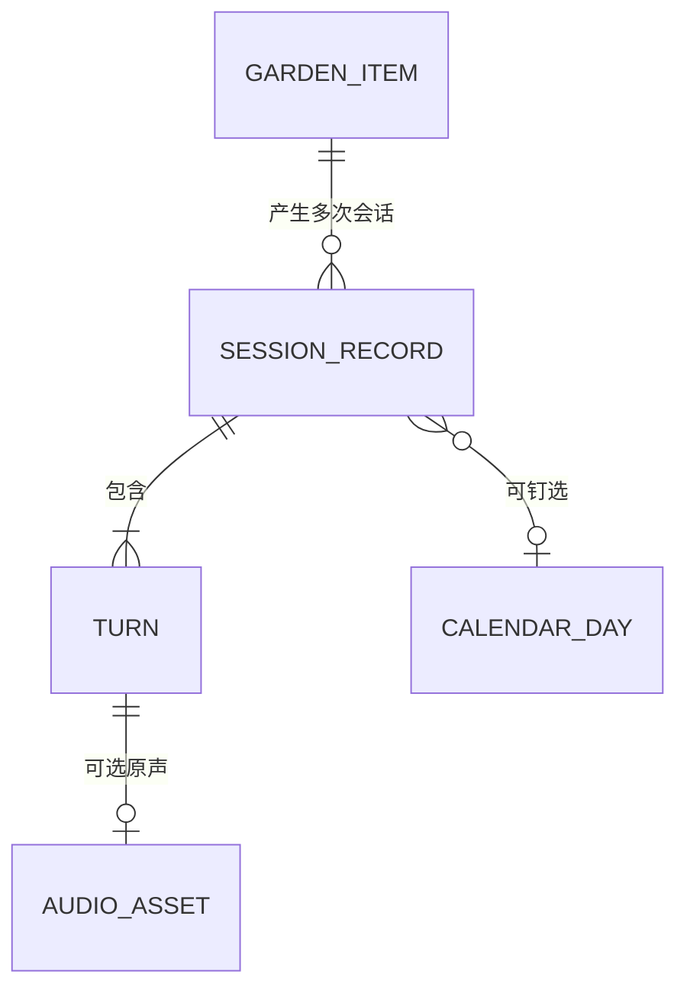

# Her AI 语音陪伴 Demo：产品、UI 与技术执行计划

> 版本：v0.4（最终视频分析与 Demo 范围确认稿）
> 日期：2026-07-15
> 状态：已分析全部八段参考视频并进入执行；当前已有可运行的交互 Demo，真实语音链路、1:1 视觉验收与外部 API 联调仍按本文后续项推进

## 1. 结论先行

目标不是一步做成商业产品，而是在一个可控范围内跑通以下闭环：

1. 上传一张图片，实时生成与参考图同一视觉语言的粒子画像。
2. 可选让视觉模型理解图片，并把简短图片描述交给对话模型；Agent 因此能围绕图片与用户自然交谈。
3. 上传并播放背景音乐；图片粒子随音乐、用户说话和 AI 发声产生可感知、但不过度抖动的响应。
4. 用户长按麦克风说话，或轻点进入可锁定的持续录音；AI 默认用英文语音回复，同时提供中文翻译与文字模式。
5. 点击 **Save Memory** 后，将本次对话、逐轮语音、双语文本和总结保存成一张可重放的“记忆卡片”，并可钉到当天日历。
6. “记忆回廊/The Garden”只展示粒子图片；点击图片进入或继续交谈。“Memory”独立展示聊天归档卡片和日历索引。
7. 提供一个独立的 **AI Salon / AI 圆桌**：用户给出话题或使用图片衍生话题，由多个角色化 AI 音色进行一段有导演感的英文交流。

建议的 Demo 技术路线：

| 层级 | 建议选型 | 原因 |
|---|---|---|
| 前端框架 | Next.js + React + TypeScript | 一个项目同时承载界面、服务端 API 和本地 Demo，部署路径短 |
| 粒子视觉 | Three.js + WebGL2 + 自定义 GLSL Shader | 能承载数万到十万级粒子、图片采样、噪声场和后期辉光 |
| 音频分析 | Web Audio API | 可分别分析麦克风、背景音乐和 AI 输出的音量与频段 |
| 语音输入 | Qwen3-ASR-Flash-Realtime（手动分轮） | 中国大陆可用；同一套音频会话可支持“长按松手”与“轻点锁定后结束” |
| 图片理解 | Qwen 视觉模型（独立适配器） | 图片只需分析一次；即使 Chat 使用 DeepSeek，也能通过结构化图片描述获得视觉上下文 |
| AI 对话 | 默认 DeepSeek；可切换 Qwen / OpenAI / Anthropic / Gemini | 对话层与语音层解耦，避免被单一供应商锁定 |
| AI 语音 | 默认 Qwen3-TTS Realtime；CosyVoice / Gemini TTS / ElevenLabs 可选 | 中英文兼容；先通过固定脚本盲听选出最接近参考视频的英文主音色 |
| 原生实时语音 | Qwen-Omni-Realtime（可选增强） | 后续需要更低延迟、可打断的端到端语音时启用 |
| 日记生成 | DeepSeek 或 Qwen + JSON Output | 将完整转写整理为结构化日记，而不是依赖语音会话临时总结 |
| Demo 存储 | IndexedDB（可用 Dexie 封装） | 不引入账号和数据库，也能持久化图片、对话和日记 |

建议采用“级联语音架构”：**ASR（语音转文字）→ 可切换 Chat Provider → TTS（文字转语音）**。它与本产品的手动分轮交互天然匹配，也允许 DeepSeek、Anthropic 这类没有原生语音输出的文本模型成为 Agent 的“大脑”。图片理解、翻译、对话、声音和总结分别可替换；Save Memory 保存每轮原始文本与音频，而不是只保留一篇日记。原生 Speech-to-Speech 作为第二条可选通道，不阻塞首个 Demo。

## 2. Demo 的范围边界

### 2.1 本轮必须完成

- 响应式 Web Demo，优先适配桌面 Chrome 与手机竖屏。
- PNG、JPEG、WebP 图片上传、裁切与粒子化。
- 背景音乐上传、播放/暂停、音量控制、循环与粒子响应。
- 长按说话、松手提交；轻点可锁定为持续录音，并提供暂停、结束和取消。
- 两种回复模式：文字、AI 语音；AI 语音默认英文，支持中英双语文字切换、语音重放和打断。
- 可选图片理解：明确征得同意后，把压缩图发送给视觉模型；关闭后仍可只围绕用户语音交谈。
- 用户、AI 双方逐轮文本、相对时间戳；经用户同意后本地保存逐轮语音。
- Save Memory：先可靠保存原始对话，再生成标题、简短总结和可选日记正文。
- 三个相互关联但独立的记忆视图：粒子回廊、会话卡片库、日历。
- AI Salon V1：3–5 个角色、英文短剧本、独立音色、顺序播放、字幕与整体保存。
- 图片、记忆、视觉随机种子和设置在本机持久化。
- API Key 仅保存在服务端环境变量中，不进入浏览器代码。

### 2.2 暂不进入首个 Demo

- 用户账号、登录、云同步、多设备同步。
- 社交分享、公开记忆、多人聊天。
- 付费、订阅、用量后台。
- 完整的角色养成、长期人格训练或向量数据库。
- 移动 App 原生安装包。
- 同时接入多个实时语音供应商。
- 让多个不同厂商的大模型在实时网络中完全自由地互相打断、无限对谈。
- 未经授权的真人音色克隆。
- 复杂的 3D 房间或 VR 记忆回廊。

## 3. 对参考图与动态视频的视觉拆解

### 3.1 可以由静态图确认的特征

- 背景接近纯黑，界面元素很少，视觉中心完全让给粒子画像。
- 图片并未完全消失：中央仍有可辨识的原图色彩和形状，但叠加了密集点阵或网格形变。
- 主体边缘不是矩形裁切，而是一个不规则的“能量场/记忆入口”，向外逐渐碎成颗粒。
- 粒子密度呈三层结构：中央高密度图像核心、边缘高亮粒子环、外部稀疏漂浮点。
- 颜色大多来自原图，再加强冷蓝、青白、暖金和少量红色高光。
- 明亮点使用累加光效；黑色区域仍保持干净，没有普遍蒙上一层灰雾。
- 对话框是深色半透明玻璃卡片：大圆角、极细描边、轻微背景模糊、居中的大号衬线文字。
- 会话控制集中在底部：大圆形麦克风、时间、Save Memory、关闭按钮。
- 记忆回廊不是规则卡片网格，而是横向画廊：中心记忆最大、两侧记忆退后并被黑场遮挡。

### 3.2 动态视频确认的运动规律

已逐帧检查 `video/demo.mp4`：720 × 900、30 FPS、约 32.53 秒。视频使以下动态目标从“推断”变成了明确需求：

| 时间段 | 视频现象 | 技术结论 |
|---|---|---|
| 0–8.6 秒 | 正面图像保持可辨识，外缘粒子持续扩散/收缩，明暗密度有呼吸 | 待机不是静止图；需要低频 Flow 与 Dispersion 动画 |
| 9–10 秒 | 整张粒子图像压成接近水平的薄带，随后恢复正面 | 不是简单 2D 扰动；粒子必须拥有 Z 深度并支持整张点云的俯仰/侧翻 |
| 10–16 秒 | 图片内部出现黑色圆洞和明亮环形边缘，随指针位置移动 | Mouse Disturbance 应是局部径向“引力井/排斥洞”，不是只做轻微 Swirl |
| 16–18 秒 | 点云从正面转成明显斜面，图片仍沿表面连续可辨识 | 需要透视相机、3D 点阵平面和阻尼旋转 |
| 18–25 秒 | 开始语音交互后，点云被拉成纵向/斜向的发光丝带；背景音乐继续驱动 | Audio Dance 主要驱动 Z 波、整体伸展和姿态，不只是粒子尺寸或 Bloom |
| 25–32.5 秒 | 打开参数面板并调高 Dance Strength、Depth Wave | 这些参数应成为可复现的 Shader Uniform，而不是写死的动效 |

抽样帧的亮像素主轴从约水平（9.5 秒约 -0.7°）逐步转为明显斜向/纵向（22.5 秒约 66.6°），而形状细长比从约 1.6 上升到约 8.3。这进一步确认画面存在大幅 3D 旋转与带状拉伸，而不是普通的平面噪声抖动。

### 3.3 视频调参面板给出的基准值

视频中可直接识别到以下参数。它们是该参考实现的内部单位，不能机械地等同于 Three.js 的物理数值，但可以作为第一轮视觉 Spike 的相对基准：

| 参数 | 视频值/范围 | 我们的对应实现 |
|---|---:|---|
| Dispersion | 1.5 | 外缘散射距离和稀疏度 |
| Particle Size | 2.8 | 点精灵基础像素尺寸 |
| Contrast | 1.3 | 纹理采样和粒子透明度对比 |
| Flow Speed | 1.0 | 噪声场随时间推进速度 |
| Flow Amplitude | 1.0 | 待机流场位移幅度 |
| Depth Strength | 50.0 | 图片亮度/程序化深度转成 Z 位移的倍率 |
| Mouse Radius | 110.0 | 局部黑洞力场半径，约 110 个参考画布像素 |
| Color Shift Speed | 2.0 | 边缘色相随时间漂移速度 |
| Audio Dance | 开启 | 麦克风/音乐是否进入舞动通道 |
| Dance Strength | 3.0 → 7.5 | 音量映射到整体伸展和深度波的增益 |
| Depth Wave | 5.0 → 8.5 | 沿点阵平面传播的 Z 波幅度 |

### 3.4 `interaction-1.mp4` 确认的会话与日记流程

已逐段检查该视频：720 × 900、30 FPS、约 102.4 秒。它不只是补充样式，还明确了页面层级和状态转换：

| 约略时间 | 画面与交互 | Demo 结论 |
|---|---|---|
| 0–5 秒 | 黑场中的上传卡片，带角标、圆形上传图标、`Share a Memory` 标题与 `Select Image` 按钮 | Setup 应是独立而克制的首屏，不用常规表单后台样式 |
| 5–10 秒 | 选择图片后直接进入粒子会话场景 | 文件选择成功后自动生成粒子画像；无需额外“确认上传”步骤 |
| 10–16 秒 | 顶部出现 Provider 胶囊与“对方正在输入”，随后中央浮现 AI 文字卡片 | Thinking 是顶部弱提示；完成的回复才占据中央视觉层 |
| 18–24 秒 | 麦克风变为高亮绿色大圆，出现本轮计时、暂停/取消；用户转写在 AI 卡片下方实时浮现 | 需要持续录音锁定态和单独的 User Transcript 小卡，而非只有按住反馈 |
| 24–75 秒 | Thinking、AI 回复、用户录音循环；上一条 AI 回复在用户录音时仍保留 | 一轮会话的卡片应平滑替换；录音时保留语境，提交后再进入 Thinking |
| 75–84 秒 | 点击 Save Memory；原页面之上出现竖向玻璃模态框、旋转状态和 `Gemini is saving...` | 保存期间不立刻导航；先锁定本地快照，再在原场景上生成日记 |
| 86–102 秒 | 同一模态框变成日记预览：标题、日期、双方署名、会话时长、可滚动正文和底部操作栏 | `Saving → Diary Preview → Gallery`，不是 `Saving → Gallery` |

参考视频里的录音行为更接近“点击开始、再次结束”，而初始需求是“长按说话”。Demo 采用兼容两者的混合交互：**按住即说、松手提交；轻点或上滑可锁定持续录音，锁定后显示暂停、完成和取消。** 键盘用户同样使用开始/结束切换。

日记预览沿用约 370 × 560（以 720 × 900 参考画布计）的竖向比例，而不是做成新的全屏页面。标题与元信息固定在顶部，正文内部滚动，底部操作栏保持可见；保存、复制、关闭分别使用青绿、低饱和白、暗红/洋红的环境辉光。视频中约 6–8 秒的生成过程只作为体验参考，不作为固定等待时长或性能目标。

### 3.5 `memory-gallery.mp4.mp4` 确认的回廊形态

已逐段检查该视频：720 × 900、30 FPS、约 53.13 秒。记忆回廊应理解为一个“活的横向舞台”，不是卡片列表：

- 纯黑全屏背景；同一时刻通常露出三段记忆，中央项最大、最清晰，两侧项缩小、变暗并被黑场自然裁掉。
- 每段记忆仍是实时粒子点云。切换时，当前项会侧翻、变薄、溶解并滑向一侧，下一项向正面展开；不能只对静态缩略图做 CSS 位移。
- 左右圆形箭头位于舞台中部；底部是一排小灰点，当前项用短白色圆角条标识。触摸横滑、触控板横移、鼠标拖拽和键盘方向键共享同一套 Carousel 状态。
- 视频中偶尔出现日记文字入口和环形音乐对象；结合最终需求，首个 Demo 的 The Garden 只保留粒子图片，文字、音频与总结统一进入独立的 Memory 卡片库。背景音乐仍可作为图片记忆的关联信息，但不在回廊主舞台上变成另一类卡片。
- 局部 Gravity Well 在回廊中仍然可交互，但力度应低于会话页，避免与横向拖拽手势冲突。
- `Upload More` 是底部低权重次级入口；标题、日期等元信息不常驻遮挡舞台，建议在中心项聚焦、悬停或进入详情时显示。

性能上只让“中央项 + 左右相邻项”维持完整 Shader 动画；更远项目使用缓存预览。切换即将发生时预热下一项，离开相邻范围后立即释放 GPU Buffer、纹理和后处理资源。

视频录屏里的蓝色点击光圈、底部大号说明字幕和强调箭头属于演示标注，不纳入产品 UI 复刻范围。

### 3.6 `vioce-interaction-2.mp4` 确认的 AI 语音交互

已逐段检查该视频：720 × 900、30 FPS、约 112.2 秒。Speaking 状态现已能够锁定：

- AI 开始发声时，顶部 Provider 胶囊的音频图标进入活动态；中央仍使用横向玻璃卡，顶部增加一条克制的微型动态波形。
- 回复以英文大号衬线文字为主。播放中显示 `tap to translate`；播放完成后出现 `replay` 与翻译入口，不另开传统音频播放器。
- 点击翻译后，同一张卡内同时显示原文与中文译文，中间用短线分隔。翻译不会覆盖或改写原文。
- 用户既可按麦克风说话，也可在 `type here...` 中输入；用户提交内容在 Thinking 阶段同样可显示为中英双语。
- AI 音频经 Web Audio 播放和分析，驱动粒子，但界面视觉焦点仍是内容和声音，不显示占据大面积的频谱图。
- 保存后的每个对话气泡右侧保留小型播放按钮，能逐轮重放 AI 与用户已同意保存的原声。

因此语音回复状态采用 `Speaking → Voice Reply Ready`：播放时显示微型波形，播放完成后保留回复卡及 replay/translate；用户按下麦克风时可立即停止当前音频并开始新一轮。

### 3.7 `voice-interaction-1.mp4` 确认的多角色 AI 氛围

已逐段检查该视频：720 × 900、30 FPS、约 78.47 秒。画面顶部仍标记 Gemini，但角色栏显示 `ChenEN / DustEN / AyEN / Dr.SharpEN / SyEN` 等自定义名称。可辨识的英文段落围绕“谁在那里”“大语言模型如何工作”“AI 是否有某种意识”“系统提示词”“人类是否也有系统提示”等问题，由不同声音依次接话。

这段效果最可能是 **角色/音色编排**，而不能从视频证明它真的同时调用了多个不同厂商模型。产品也不应把多个角色虚假标成多个模型。推荐实现为 **AI Salon / AI 圆桌**：

1. 用户输入话题、从推荐话题中选择，或让视觉模型根据图片提出一个话题。
2. `Scene Director` 根据话题、氛围、角色和轮数一次生成结构化英文短剧本。
3. 每句包含 `speakerId / text / emotion / pauseAfterMs / translation`。
4. TTS 按角色调用不同 `voiceId`，预生成短音频并依次播放；当前发言角色的胶囊高亮。
5. 粒子响应当前声音；中央浮现小型波形卡与该句字幕。结束后可重放、保存为一段特殊的 Salon Memory。

首个 Demo 不让 5 个 Agent 无限自由聊天。一次生成 5–8 轮、每轮 1–2 句，可以更稳定地控制文风、时长、费用与《Her》式留白。第二阶段才提供“即兴模式”：每个角色读取前文后逐轮生成；它们可以使用同一模型的不同 System Prompt，也可以显式绑定不同 Provider，但 UI 必须如实披露。

推荐的导演参数：`late-night intimate` 氛围、英文主语言、3–5 个角色、短句、350–900 ms 自然停顿、允许轻微犹豫/叹息、避免解释性长篇输出。推荐话题只提供开放问题，例如记忆、孤独、梦、时间、音乐与“人类是否也有系统提示词”，不预写固定答案。

### 3.8 `voice-card-gallery.mp4` 确认的记忆卡片与日历

该视频为 720 × 900、30 FPS、约 18.47 秒；结合 `vioce-interaction-2.mp4` 后半段，可以确认记忆系统应拆成三层：

| 视图 | 负责展示 | 不负责 |
|---|---|---|
| **The Garden / 粒子回廊** | 上传过的粒子图片；中心项和相邻项保持实时动画 | 不承载长文本、聊天气泡和日记阅读 |
| **Memory Cards / 会话卡片库** | 封面、标题、参与者、会话时长、绝对时间、简短总结、双语逐轮消息、语音重放 | 不替代粒子回廊 |
| **Calendar / Day-night Chron** | 哪一天保存或钉住了哪些会话；日期上的小点表示数量 | 不把日历当成主要内容阅读页 |

会话卡片使用三维横向 Carousel：中央卡正面展开，两侧卡轻微 `rotateY` 后退。卡片本体必须使用可访问的 DOM/CSS，而不是把文本烘焙成 WebGL 纹理；这样正文可滚动、文字可选择、播放按钮可聚焦。卡片字段由上到下为：封面图、标题、参与者与时长、时间戳、2–4 句总结、分隔线、左右错位的双语对话气泡和逐轮播放按钮。

保存确认后可打开日历选择器。默认选中当天，但“保存成功”和“钉到日历”是两个独立操作：用户跳过钉选不会导致记忆丢失。一个日期可关联多条会话；日期显示小点数量，点击后筛选对应卡片。

### 3.9 最终参考边界

八段视频仍没有提供 Shader 源码、粒子总数、原始音频频谱和音色供应商元数据。因此粒子最终验收继续采用“同一张输入图 + 同一段测试音频 + 对照录屏”；音色采用固定英文脚本盲听评审，而不声称能识别或复制未知的专有声音。

视频里的 `Gemini` 胶囊能证明当时界面把 AI Brain 标成 Gemini，但不能证明声音一定来自 Gemini。可见的 `ChenEN / DustEN / SyEN` 等名称也不在 Gemini 官方预置音色名中，更像产品自己的别名。最终音色必须通过供应商试听而非界面猜测确定。

## 4. 粒子画像的实现方案

### 4.1 为什么选 Three.js + WebGL2

- **Three.js** 管理相机、纹理、几何、渲染循环和后处理。
- **WebGL2** 让计算主要发生在 GPU，而不是让 JavaScript 每帧逐个移动数万粒子。
- **GLSL Shader** 是在显卡上运行的小程序：Vertex Shader 决定粒子位置，Fragment Shader 决定粒子的颜色、透明度和形状。
- **SVG** 适合图标和矢量插画，不适合数万粒子逐帧更新。
- **p5.js** 适合快速数字艺术草图，但在精细后处理、复杂 Shader 管线和产品工程组织上不如 Three.js 直接。
- 首个 Demo 不采用 WebGPU；WebGL2 的浏览器覆盖更稳，能力已足够。

### 4.2 V5 采用“单一粒子图像 + 反馈拖尾”的合成

**A. 高密度粒子重构层**

- 桌面端按画布面积使用约 68,000–132,000 个表面点，低性能设备自动降低预算；图片颜色直接采样到点精灵，主体中心保持更密、更稳定且颜色准确的点阵，所以不依赖连续照片也能辨认。
- 暗部不再因“颜色亮度 × 透明度”被二次压暗；眼睛、头发和阴影仍保留足够粒子密度。
- 从主体中心向轮廓过渡时，粒子透明度、尺寸、流场和音频位移连续增强；点云仍具有伪深度并支持 3D 拖拽与弹性回正。

**B. 无矩形边框的空间遮罩**

- 正常渲染时连续 `` 保持不可见，只在 WebGL 不可用时作为降级图出现；因此成品不存在“原图 + 粒子贴层”的双重结构。
- CPU 采样和 Vertex Shader 共同使用带低频扰动的不规则径向包络；靠近画面四角与边界时，粒子透明度逐渐降为零，并把边缘点转移到扩散/Halo 通道，消除图片四角和矩形边框。
- `Subject Detail` 只控制主体粒子的稳定性、点径和颜色保真，不控制底图透明度；默认 0.72，拖拽与鼠标力场作用后主体仍由同一批粒子连续重构。

**C. 边缘溶解与外围 Halo 层**

- 使用不规则椭圆/SDF 遮罩定义“记忆入口”。
- 只在人物保护区外和画面外围发射粒子；眼睛、鼻子、嘴等内部亮度边缘不能直接产生远距离 Halo。
- Halo 上限约为核心预算的 20%；径向扩散、切向旋流和随机方向共同形成视频中的蓝白粒子带，同时避免静止状态吞没主体。
- 使用 Simplex Noise 与 Curl Noise 让边缘像被气流剥离，而不是机械地向外爆炸。

**D. 交互场、声音响应与后期合成层**

- 指针附近同时存在宽范围吸引、切向 Swirl、中心排斥和高亮环，形成黑色 Gravity Well 与蓝白边界。
- 用户说话、AI 发声和音乐增加深度波、外围呼吸、粒径和闪光；主体中心仍保留较低但可见的运动量。
- 少量独立高亮点在外部黑场缓慢漂移，并在音乐瞬态或说话重音时短暂增亮。
- Bloom 只让超过阈值的亮点泛光。
- Additive Blending 用于主体粒子、亮环和 Halo；独立 2D 反馈画布每两帧采样当前 WebGL 粒子结果并逐渐擦除，形成真正的时间衰减拖尾。
- Vignette 压暗画面边缘；Tone Mapping 保护高光层次。
- 调参面板中的 Dispersion、Particle Size、Contrast、Flow Speed/Amplitude、Depth Strength、Mouse Radius、Color Shift Speed、Dance Strength 和 Depth Wave 均直接写入 Shader Uniform。

### 4.3 单个粒子携带的数据

每个粒子至少保存：原始 `x/y/z`、图片 UV、颜色、随机种子、尺寸、边缘权重、深度权重、生命周期和所在层级。Vertex Shader 每帧从这些稳定属性和 Uniform 计算当前位置，因此点云无论如何侧翻、伸展或出现局部黑洞，都能连续回到可辨识的原图。

首版优先使用“解析式 Shader 位移”：根据时间、音频和鼠标位置直接计算粒子位置，不保存每个粒子的逐帧速度。这样不必一开始就上复杂 GPGPU Simulation。只有当后续需要持久涡旋、粒子碰撞或长时间惯性轨迹时，再把位置/速度写入浮点纹理。

### 4.4 音频如何驱动粒子

Web Audio API 的 `AnalyserNode` 会把声音拆成频谱。麦克风、背景音乐和 AI 语音使用三条独立分析链，再做受控混合：

| 音频特征 | 视觉映射 |
|---|---|
| 总音量 RMS | `Dance Strength`：整体 Z 伸展、点云姿态和带状拉伸的主增益 |
| 低频/鼓点 | `Depth Wave`：沿点阵传播的大尺度深度波；外缘径向脉冲 |
| 中频/人声主体 | 核心网格的局部深度、Flow Amplitude 和轻微侧翻 |
| 高频/齿音与亮音 | 闪光粒子、Bloom 强度 |
| Spectral Flux（频谱瞬变） | 短促的火花爆发，而不是持续抖动 |

必须加入 Attack/Release、指数平滑和上限裁切。视频中的强烈丝带形态应在较强人声/音乐或调高 Dance Strength 后出现；普通说话默认处于中等幅度，不能每一轮都把图片彻底压成一条线。

背景音乐在 AI 说话时建议自动降低约 6–10 dB（Audio Ducking），回复结束后缓慢恢复，保证语音可懂度。

### 4.5 鼠标/触摸交互

首个 Demo 实现视频中明确出现的两个指针通道：

- **Local Gravity Well**：指针附近产生圆形黑洞，中心粒子向 Z 轴内陷或被移开，边缘形成明亮环；半径使用 `Mouse Radius` 控制。
- **Global Tilt**：指针相对画布中心的位置映射到整张点云的轻微俯仰；拖拽或高交互强度时可接近侧视薄带。
- 两个通道都加入阻尼，离开后平滑回到正面原图，不能瞬间跳回。
- 长按麦克风时，指针交互自动减弱，避免视觉反馈互相竞争。

Gravity Well 已由视频确认为 MVP；Swirl 和 Magnetic Field 降为后续视觉预设。

## 5. 术语说明与 Demo 取舍

### 5.1 视觉与后处理

| 术语 | 通俗解释 | Demo 处理 |
|---|---|---|
| Glow Intensity | 亮点周围的光晕强度 | 必做；受高频轻微调制 |
| Bloom Threshold | 亮到什么程度才开始泛光 | 必做；阈值过低会把黑场染灰 |
| Trail Length | 粒子运动后残影保留多久 | 短拖尾可选；默认克制 |
| Color Shift / Hue Drift | 粒子颜色随时间缓慢偏移 | 少量使用，仍以原图颜色为主 |
| Alpha Blending | 按透明度混合前后画面 | 核心图像与暗粒子使用 |
| Additive Rendering | 亮度相加，粒子越重叠越亮 | 高亮粒子和 Bloom 前使用 |

### 5.2 粒子与力场

| 术语 | 通俗解释 | Demo 处理 |
|---|---|---|
| Particle Field | 整个粒子群及其空间分布 | 必做 |
| Particle Emission | 新粒子从边缘或某一点产生 | 音乐瞬态时少量使用 |
| Particle Decay | 粒子逐渐淡出或死亡 | 外缘火花使用；核心粒子不死亡 |
| Particle Noise | 用连续噪声而非纯随机数驱动 | 必做，避免“电视雪花”感 |
| Particle Attraction/Repulsion | 粒子被吸引或排斥 | 指针排斥 + 回归原位 |
| Particle Flow | 粒子沿一个连续场流动 | 边缘溶解层使用 |
| GPU Instancing | 一次绘制大量相同网格 | 小球/精灵需要；纯点云优先用 BufferGeometry |
| GPGPU Simulation | 用 GPU 纹理保存和更新粒子状态 | 首版解析式 Shader 足够；需要持久速度/惯性时再启用 |
| Force Field Interaction | 多种力共同影响粒子 | 必做：局部黑洞、全局 Tilt、音频 Depth Wave |
| Gravity Well | 向某个中心点吸入或制造深度凹陷 | 视频明确出现，列入 MVP |
| Magnetic Field Simulation | 沿类似磁力线的方向运动 | 视觉实验项，暂缓 |

### 5.3 噪声与流场

| 术语 | 通俗解释 | Demo 处理 |
|---|---|---|
| Perlin Noise | 平滑连续的随机起伏 | 可用于慢速背景起伏 |
| Simplex Noise | 更适合 Shader 的连续噪声 | 主噪声选择；“Simple Noise”通常指它 |
| Curl Noise | 产生旋涡式、近似无压缩流动的噪声 | 边缘粒子主要运动方式；“Crul”应为 Curl |
| Vector Field | 每个空间位置都有一个速度方向 | Curl、鼠标力场和音频脉冲的共同载体 |
| Turbulence | 多尺度、不规则的湍流感 | 只加在外缘，核心图像保持可读 |
| Noise Octaves | 叠加不同尺度的噪声层 | 建议 2–4 层；越多越贵且越躁 |

### 5.4 初始视觉参数建议

以下不是最终值，而是第一轮视觉 Spike 的起点；所有参数放进仅开发环境可见的调试面板：

| 参数 | 桌面初值 | 移动端初值 |
|---|---:|---:|
| 核心点云数 | 90,000 | 36,000 |
| 外缘/火花粒子数 | 20,000 | 8,000 |
| Dispersion | 1.5（参考内部单位） | 1.3 |
| Point Size | 2.8 px | 2.4 px |
| Contrast | 1.3 | 1.25 |
| Flow Speed / Amplitude | 1.0 / 1.0 | 0.85 / 0.8 |
| Depth Strength | 50（参考内部单位） | 36 |
| Mouse Radius | 110 参考像素 | 触点短边的 14% |
| Dance Strength | 默认 3.0，可到 7.5 | 默认 2.5，可到 6.0 |
| Depth Wave | 默认 5.0，可到 8.5 | 默认 4.0，可到 7.0 |
| Bloom Strength / Threshold | 1.15 / 0.32 | 0.9 / 0.38 |
| Color Shift Speed | 2.0（参考内部单位） | 1.6 |

设备性能不足时按帧率自动降低粒子数和 Bloom 分辨率，而不是让交互掉到不可用帧率。

## 6. 页面与交互设计

### 6.1 页面信息架构

1. **Setup / 创建一段记忆**
   - 首屏中央使用带装饰角标的虚线上传卡，包含 `Share a Memory`、说明文字与 `Select Image`。
   - 选择图片后自动进入粒子化，不增加多余确认页；不支持的格式、超大文件和读取失败在卡片内就地提示。
   - 明确提供“让 AI 看懂这张图片”开关及隐私说明；开启后才把压缩副本发送给视觉模型。
   - 背景音乐、文字/语音模式、回复语言和 AI 音色放在轻量设置抽屉中，避免削弱上传动作的视觉焦点。
2. **Conversation / 交谈**
   - 全屏粒子画布。
   - 顶部 Provider 胶囊和 Thinking 提示；中央 AI 文字/语音回复卡；其下按需出现用户实时转写小卡。
   - 底部麦克风、本轮/会话计时、Save Memory、关闭与 Upload Another。
   - 音乐、回复模式、记忆回廊入口保持为弱化图标。
   - 右上角保留视频中出现的参数入口：普通用户看到 3 个预设，Advanced 面板才显示 Dispersion、Flow、Depth、Dance 等滑杆。
3. **AI Salon / AI 圆桌**
   - 输入或抽取话题，选择 3–5 个角色/音色和英文/中文模式。
   - 粒子场上方显示角色胶囊；当前说话者高亮，中央波形卡同步显示该句字幕。
   - 可暂停、继续、重放或保存整段；V1 不允许角色无限自由聊天。
4. **Memory Preview / 保存预览**
   - 以竖向玻璃模态框覆盖在当前粒子场景上；先呈现生成中，再在同一容器内替换为记忆预览。
   - 固定标题、日期、参与者、会话时长、简短总结和底部操作栏；双语逐轮正文独立滚动。
   - 每轮音频提供重放。底部提供确认保存、复制摘要、关闭；关闭时本地草稿不能丢失。
5. **The Garden / 粒子回廊**
   - 纯黑背景和横向画廊。
   - 只展示上传图片的粒子形态；中心图片最大、两侧图片部分露出。
   - 中央与左右相邻项实时渲染，其他使用缓存缩略图；切换时表现为点云在三维空间侧翻、溶解和展开。
   - 点击中心图片进入 Conversation：若已有会话，可选择继续或开始一段新会话。
6. **Memory Cards / 会话卡片库**
   - 三维横向卡片 Carousel；中央卡完整可读，两侧卡退后。
   - 展示封面、标题、参与者、时长、时间戳、总结、双语逐轮消息和语音重放。
7. **Calendar / Day-night Chron**
   - 月历按日期显示保存记录数量；保存后可选择钉到当天或其他日期。
   - 点击某日筛选对应会话卡，不把内容直接塞进日历格。
8. **Memory Detail / 会话详情**
   - 展开一张完整记忆卡；可修改标题、钉选日期、重放、复制、查看可选日记长文或删除本地记录。

### 6.2 会话状态机



### 6.3 AI Salon 状态机



### 6.4 视觉 Token

- 背景：`#000000`；不要使用常见的深灰后台风格。
- 对话卡：黑蓝色半透明、24–32 px 模糊、1 px 低对比描边。
- 正文：思源宋体 / Noto Serif SC 一类的中文衬线字体；英文可用高对比衬线体。
- 功能文字：轻量无衬线或等宽字体；计时器使用等宽数字。
- 主操作强调色：偏青绿；关闭/错误使用低饱和红色。
- 动效时长：按钮反馈 120–180 ms；回复卡片 350–550 ms；记忆切换 600–900 ms。
- 视频中顶部的 Provider 状态胶囊继续保留，但显示当前“AI 大脑”，例如 DeepSeek / Qwen；语音服务名称只在设置中展示，避免主界面出现两个模型名称造成困惑。
- AI 回复卡为横向深色玻璃面板，正文使用大号居中衬线体；单行时保持克制宽度，多行时限制最大宽度并自然增高。
- 用户实时转写使用更小、更轻的玻璃卡，与 AI 回复在层级上明确区分，不能伪装成 AI 已发送的内容。
- 录音锁定态的主圆变为高亮青绿色，并出现本轮录音计时；暂停与取消按钮只在此状态展示。
- 语音回复卡顶部只保留约 8–12 根短波形线；播放结束后波形让位给 replay/translate，避免同时出现两套状态。
- 保存预览与归档卡使用竖向玻璃容器、细边框和深蓝黑动态背景；正文有独立细滚动条，底部工具栏通过模糊背景与正文分层。
- 卡片库的三维位移使用 CSS `perspective + rotateY + translateZ`；文字始终是 DOM，不以截图形式渲染。

### 6.5 麦克风交互细节

- `pointerdown` 立即采集并进入 `ListeningHold`；持续按住后松开即提交，触摸与鼠标统一。
- 短按或明确的锁定手势进入 `ListeningLocked`；此时无需继续按住，并展示暂停、完成、取消和本轮计时。
- 需设定短按判定阈值与最短有效语音时长，防止点击意图和空录音冲突；阈值在真实手机上测试后确定，不在计划阶段写死。
- 录音期间上一条 AI 回复保持可见，实时转写在其下方小卡中更新；完成后用户小卡淡出，顶部进入“对方正在输入”。
- 取消只丢弃当前未提交音频，不清空此前会话；暂停期间停止向 ASR 发送新音频，但保留已转写内容。
- AI 说话时再次按住应立即停止播放并开始新一轮输入（barge-in）；被打断的 Turn 标记为 `interrupted`，重放时仍可播放完整缓存音频。
- `Space` 可按住说话，`Enter` 可开始/结束锁定录音，`Esc` 取消；所有图标提供文字标签和焦点状态。

### 6.6 双语文字与 AI 语音回复

- Thinking 只使用顶部轻提示，不在中央放大型加载器；新的 AI 文本流式到达后，中央玻璃卡淡入并按句稳定排版。
- 为避免流式文本不停重排，先在隐藏测量层计算行高，按短句或标点批量更新；生成结束后再做一次轻微亮度落定。
- 默认 `replyLanguage = en`：AI 用英文生成并发声；用户可说中文、英文或中英混合，ASR 保留原语言。
- 翻译作为独立字段保存，不能用翻译替换原文。会话页默认只显示主语言，点击 `tap to translate` 展开双语；归档卡默认双语。
- AI 发声时显示微型波形；播放结束后出现 replay/translate。Replay 使用已缓存音频，不重复调用 TTS 计费。
- 首个 Demo 只朗读英文主回复；如用户选择中文语音模式，再为中文回复调用对应音色。翻译文本默认不自动朗读。
- 自动语言检测置信度低时保留原始 ASR 文本并提示用户选择语言，不能悄悄“纠正”专有名词。

### 6.7 保存预览与会话卡片

- Save Memory 首先冻结会话快照并写入本地，然后显示竖向生成模态框。网络失败时同一模态框给出“本地草稿已保存 / 重试整理”。
- 预览包含：标题、保存日期时间、参与者、会话总时长、2–4 句总结、可选日记长文、双语逐轮消息、每轮相对时间与音频重放。
- 底部确认保存后记录进入 Memory Cards，再询问是否钉到日历；复制默认复制标题、总结和双语文本，不复制本地音频地址。
- Card Carousel 的中心卡可内部滚动；拖动滚动条或点击播放按钮时禁止触发横向换卡。侧卡不响应内部按钮，点击只负责居中。
- 同一张粒子图片允许关联多次会话，因此卡片记录与 Garden 图片使用一对多关系，而不是互相覆盖。

### 6.8 粒子回廊交互细节

- 使用一个 WebGL 舞台管理三个活跃记忆槽位，而不是为每张记忆各建一个 Canvas；这样更容易共享相机、后处理和 GPU 预算。
- Carousel 使用离散索引，但拖拽过程连续：水平位移同时映射到 `position.x`、`rotation.y`、缩放、透明度和 Dispersion。
- 中心项静止后恢复较完整的图片可辨识度；退到两侧时增加溶解、降低 Bloom 和交互强度，营造从黑场中出现/消失的感觉。
- 点击中心项进入该图片的 Conversation 入口；若有历史会话，先显示“继续最近会话 / 开始新会话”。点击侧项只把它移到中央。
- 若只有 1 段记忆，隐藏箭头和分页点；2 段时不做无限循环错觉；数量较多时分页点可压缩，但必须保留当前相对位置。
- 回廊不展示日记卡或聊天气泡；关联音乐只在进入图片后由用户明确启动，不能在滑动回廊时自动播放。

### 6.9 日历交互细节

- 保存和钉选分开：确认保存后记录已经安全进入卡片库，再打开轻量日历选择器。
- 默认高亮本地时区的当天；用户可改选其他日期、跳过或稍后在详情中修改。
- 日期格使用 1–3 个小点表示少量记忆，超过 3 条显示 `3+`；点击日期后进入筛选后的 Memory Cards。
- `createdAt` 永远保留真实创建时间，`pinnedDate` 只是用户赋予的回忆日期，两者不可混为一个字段。

### 6.10 AI Salon 交互细节

- V1 提供 `Topic / Mood / Roles / Turns / Language` 五项设置；默认 English、`late-night intimate`、4 个角色、6 轮。
- `Surprise me` 可以从图片描述和策划好的开放题库中抽取话题，但不会读取用户其他私密记忆。
- 角色栏显示人格别名和音色别名，不显示虚假的模型厂商；只有真正绑定不同 Provider 时才在详情中披露。
- Director 一次生成完整结构化剧本，TTS 按句并行预取、顺序播放；至少缓存后两句，避免角色之间出现网络型长空白。
- 当前角色高亮，其他角色退暗；句间保留自然停顿，粒子颜色/脉冲可按角色做轻微差异，但不为每个角色设计一套完全不同的页面。
- 保存后的 Salon 记录进入同一个 Memory Cards 与 Calendar，`mode` 标为 `salon`，参与者显示角色名而不是 `YOU / AI`。

## 7. 大模型与语音选型

### 7.1 结论：可以优先使用中国大陆 API

可以先用 DeepSeek 与 Qwen 代替 OpenAI，但需要区分“AI 大脑”和“声音管线”：

- **DeepSeek** 当前提供 OpenAI/Anthropic 兼容的文本 Chat API，支持流式输出与 JSON Output；适合陪伴回复和日记生成，但它本身不负责浏览器麦克风转写与 TTS 发声。
- **Qwen / 阿里云 Model Studio** 同时覆盖图片理解、实时 ASR、文本模型、实时 TTS 和端到端 Qwen-Omni-Realtime；更适合作为首个 Demo 的中国区多模态与语音基础设施。

DeepSeek 官方当前模型为 `deepseek-v4-flash` 与 `deepseek-v4-pro`；旧别名 `deepseek-chat`、`deepseek-reasoner` 将于 2026-07-24 弃用，因此新代码不使用旧别名。来源：[DeepSeek Quick Start](https://api-docs.deepseek.com/)、[Chat Completion API](https://api-docs.deepseek.com/api/create-chat-completion/)。

### 7.2 推荐的首个 Demo 默认链路

1. **Image Context：`qwen3-vl-flash` 或当前 Qwen 视觉快速模型**
   - 只在用户开启“让 AI 看懂图片”后调用一次，输出 `objects / scene / mood / possibleTopics / uncertainty`。
   - 后续对话只发送这段结构化描述，不在每一轮重复上传原图；用户也可查看和删除描述。
2. **ASR：`qwen3-asr-flash-realtime`**
   - 设为 Manual Mode，长按期间发送音频，松手时 `commit`。
   - 官方文档说明它可返回实时转写和七类情绪标签；情绪只能作为 Agent 语气的弱信号，不能当作心理诊断。
3. **Chat：`deepseek-v4-flash`**
   - 关闭 Thinking，使用流式文本输出，优先降低陪伴对话的等待时间。
   - 系统提示控制温暖、简短、非说教的人格；把图片描述作为可引用但不强行追问的背景。
   - 如果 DeepSeek 账号不可用，改用 `qwen-plus` 或当前 Qwen Plus 快照，不改变 UI 与数据结构。
4. **Translation：默认复用 Chat Provider 的低延迟调用**
   - 英文回复完成后异步生成中文译文；翻译失败不阻塞英文播放。
   - 保存原文与译文的对应关系，不把翻译结果重新注入会话造成上下文重复。
5. **TTS：`qwen3-tts-flash-realtime` 流式输出**
   - 英文优先；先通过固定脚本从预置音色和 Voice Design 中选出 `Intimate / Reflective / Bright` 三个预设。
   - CosyVoice 保留为中国区备用，Gemini TTS 与 ElevenLabs 作为配置 Key 后的英文高表现选项。
   - 文本模式跳过 TTS；语音模式边接收音频边播放，并把 AI 音频送入粒子分析节点。
6. **Memory Summary：`deepseek-v4-pro` 或 Qwen Plus + JSON Output**
   - 返回标题、2–4 句总结、可选日记长文和 mood tags；原始 Turn 永远单独保存。

Qwen 图片输入与 OpenAI-compatible 调用见[图像与视频理解](https://help.aliyun.com/en/model-studio/vision)；Qwen-ASR 的手动分轮与情绪字段见[实时语音识别文档](https://help.aliyun.com/en/model-studio/real-time-speech-recognition-user-guide)；Qwen3-TTS 的中英文音色见[官方音色列表](https://help.aliyun.com/en/model-studio/qwen-tts-voice-list)。

### 7.3 为什么首版采用级联，而不是直接用 Qwen-Omni

级联链路与长按说话天然匹配，而且可以只替换中间的 Chat Provider：



代价是 ASR → LLM → TTS 会比原生 Speech-to-Speech 多一段延迟。若后续追求自然打断、情感语音理解和更低延迟，可增加 `NativeRealtimeProvider`：中国区用 `qwen3.5-omni-plus-realtime`，海外再选 OpenAI Realtime 或 Gemini Live。Qwen 当前支持 WebSocket/WebRTC、多个实时音色和自定义克隆音色，见[Qwen-Omni-Realtime](https://help.aliyun.com/en/model-studio/realtime)。

### 7.4 Provider 抽象与可切换范围

不能只把所有服务都假装成一个 OpenAI 接口；各供应商的流式事件、错误、上下文和音频协议并不完全相同。服务端定义小而独立的接口，并将供应商事件转成自己的统一事件：

```ts
interface SpeechToTextProvider {
  start(session: SttSession): Promise<void>;
  pushAudio(chunk: ArrayBuffer): Promise<void>;
  commit(): AsyncIterable<TranscriptEvent>;
}

interface ImageContextProvider {
  describe(input: ImageContextInput): Promise<ImageContext>;
}

interface ChatProvider {
  streamReply(input: ChatInput): AsyncIterable<ChatDelta>;
}

interface TextToSpeechProvider {
  streamAudio(input: SpeechInput): AsyncIterable<AudioChunk>;
}

interface MemorySummaryProvider {
  generate(input: MemorySummaryInput): Promise<MemorySummary>;
}
```

首个 Demo 的支持边界：

| Provider | 文本 Chat | 图片理解 | TTS/原生语音 | 首版处理 |
|---|---|---|---|---|
| DeepSeek | 是 | 通过独立 Vision Adapter | 无 | 默认 Chat 与 Summary，真实接通 |
| Qwen | 是 | 是 | 是 | 默认 Vision、ASR、TTS，Chat 备用；真实接通 |
| OpenAI | 是 | 是 | 是 | 保留真实 Chat/Vision Adapter 与配置槽；Realtime 后续接入 |
| Anthropic | 是 | 是 | 无原生 TTS | 保留真实 Chat/Vision Adapter；声音复用所选 TTS Provider |
| Gemini | 是 | 是 | 是 | 保留真实 Chat/Vision/TTS 配置槽；Gemini Live 后续接入 |
| ElevenLabs | 否 | 否 | TTS/Voice Design | 仅作为可选 Voice Provider，不接触完整聊天上下文 |

“保留选择”在首版的含义是：**五种文本大模型都使用同一个会话、日记和 UI 数据结构；服务端包含各自 Chat Adapter，只有配置了相应环境变量的选项才在设置中可选。** 首版不同时实现三套原生实时音频协议，否则会明显扩大调试范围。

参考：Qwen 提供 [OpenAI-compatible Chat Completions](https://help.aliyun.com/en/model-studio/qwen-api-via-openai-chat-completions)；OpenAI 浏览器原生语音使用 [Realtime/WebRTC](https://developers.openai.com/api/docs/guides/realtime-webrtc)；Anthropic 当前模型为文本输出，见[Claude 模型能力](https://platform.claude.com/docs/en/about-claude/models/overview)；Gemini Live 提供原生音频，见[Gemini Live API](https://ai.google.dev/gemini-api/docs/live-api/capabilities)。

### 7.5 设置界面与密钥规则

- 设置中分为 `AI Brain`、`Image Understanding` 和 `Voice`。例如可以选择“DeepSeek + Qwen Vision + Intimate English”，普通用户只看到友好名称，Advanced 中才显示供应商。
- `AI Brain` 列表：DeepSeek、Qwen、OpenAI、Anthropic、Gemini；未配置 Key 的选项置灰并显示“未配置”。
- 所有长期 API Key 只存在服务端 `.env.local`，浏览器只能调用自己的 `/api/chat`、`/api/diary`、`/api/tts` 等路由。
- 不允许在某个 Provider 失败后悄悄把同一段私密对话发送给另一家；切换或重试必须由用户明确触发。
- 模型 ID、Base URL 和地区都放在配置层，业务组件不出现供应商字符串。

### 7.6 音色来源判断与试听方案

不能仅凭视频顶部的 `Gemini` 标签断定声音来自 Gemini：那更可能表示 AI Brain。视频里的 `ChenEN / DustEN / AyEN / Dr.SharpEN / SyEN` 不属于 Gemini 官方列出的 30 个预置 TTS 名称，可能是产品自定义别名、Voice Design 或第三方 TTS。

Gemini TTS 当前支持自然语言控制风格、口音、速度和语气，并提供单/双说话者输出；官方双说话者接口每次最多 2 个角色。因此 3–5 人 AI Salon 即使用 Gemini，也应按 Turn 分别合成，或分段组合，不能依赖一次五说话者请求。来源：[Gemini TTS 官方文档](https://ai.google.dev/gemini-api/docs/speech-generation)。

编码 TTS 前先做一页 **Voice Bake-off**，使用同一组英文脚本、同一响度和播放设备，盲听以下路线：

1. Qwen3-TTS 预置音色与 Qwen Voice Design：大陆调用方便，支持中英文；优先试听偏电影感、克制、亲密的年轻/中性音色。
2. Gemini TTS：试听 `Achernar（Soft）`、`Vindemiatrix（Gentle）`、`Sulafat（Warm）`、`Aoede（Breezy）` 等候选，并用 Director Notes 控制 breathiness、pace 和停顿。
3. ElevenLabs：仅在网络与预算允许时作为英文高表现候选；其 Voice Design 与多音色能力适合角色对谈，但不作为大陆首版硬依赖。

评分维度：亲密感、自然停顿、气声程度、英文口音、情绪克制度、长句稳定性、中英切换一致性和首包延迟。最终用用户盲听结果命名为 `Intimate / Reflective / Bright`，而不是把供应商名称当作体验名称。阿里云的 Qwen/CosyVoice Voice Design 支持用中英文描述目标音色，见[Voice Design API](https://help.aliyun.com/en/model-studio/voice-design-api-references)；Qwen3-TTS 提供多种支持中英文的预置音色，见[官方音色列表](https://help.aliyun.com/en/model-studio/qwen-tts-voice-list)。

声音克隆仅允许用户克隆自己或已获得明确授权的声音；必须记录同意、提供删除入口，并披露为 AI 合成语音。不会从参考视频反向克隆未知人物或产品音色。

### 7.7 AI Salon 的编排架构

V1 使用一个 `SceneDirector` 生成整段结构化脚本，再交给多个 Voice Profile 演出。这能复现“多个 AI 在交换想法”的感觉，又不要求多家模型互相建立实时连接：

```ts
type SalonLine = {
  speakerId: string;
  textOriginal: string;
  textZh?: string;
  emotion?: "curious" | "reflective" | "wry" | "warm" | "uncertain";
  pauseAfterMs: number;
};

type SalonScene = {
  topic: string;
  mood: string;
  language: "en" | "zh";
  roles: Array<{ id: string; persona: string; voiceId: string }>;
  lines: SalonLine[];
};
```

Director Prompt 只规定场景、角色差异、轮数、短句和安全边界，不预先写死答案。输出需通过 JSON Schema 验证，并检查角色是否均有发言、总时长是否超限、是否出现重复句。TTS 可并行预取，但播放器按 `lines` 顺序串行播放；某句失败时允许跳过或单句重试，不重新生成整段剧本。

## 8. 背景音乐与声音混合

- 支持 MP3、WAV、M4A/MP4 Audio；具体格式以目标浏览器解码能力为准。
- 用户手势后再初始化 `AudioContext`，规避浏览器自动播放限制。
- 音乐默认只在当前会话播放；是否长期保存音乐文件作为一个单独选项，避免 IndexedDB 被大文件填满。
- 音乐与麦克风分别分析，不能把扬声器里的音乐当成用户语音。
- 麦克风请求开启浏览器的 echo cancellation、noise suppression 和 auto gain control，再在真实设备上试听。
- AI 语音输出单独进入分析节点，使 AI 说话时粒子也有较缓慢、较圆润的响应。
- 用户说话、AI 说话和音乐应有不同的视觉权重，避免三种输入同时把画面推到最大值。

## 9. Save Memory 与数据设计

### 9.1 保存流程

1. 用户点击 Save Memory。
2. 立即在 IndexedDB 建立 `SessionRecord(draft)`，冻结完整双语文本、会话时长、Provider 信息，以及已获同意保存的逐轮音频引用。
3. 在当前会话页上打开竖向 `Saving` 模态框；服务端只接收文本快照并生成标题、2–4 句总结、mood tags 和可选日记长文。
4. 成功后在同一模态框展示可滚动 Memory Preview；逐轮气泡、时间戳和音频在本地组装，不让总结模型改写原始对话。
5. 用户确认后将状态改为 `ready`，记录进入 Memory Cards；随后可选钉到某个日历日期。
6. 关闭预览只退出模态框，不删除 `draft`；生成失败时仍可直接保存“未总结”的会话并稍后重试。

### 9.2 为什么拆成 Garden Item 与 Session Record

一张上传图片可以被反复打开并产生多次聊天，粒子回廊与聊天归档不能共用一条扁平记录：



- `GardenItem` 决定 The Garden 里显示什么：图片、裁切、粒子种子、视觉预设和可选音乐。
- `SessionRecord` 决定 Memory Cards 里显示什么：标题、总结、双语 Turn、逐轮音频、时长和日历日期。
- 删除一段会话不删除原始粒子图片；删除 Garden Item 时若仍有关联会话，必须二次确认并说明影响。

### 9.3 最小数据模型

```ts
type Turn = {
  id: string;
  role: "user" | "assistant" | "salon_speaker";
  speakerId?: string;
  textOriginal: string;
  originalLanguage: string;
  translationZh?: string;
  translationEn?: string;
  provider?: "deepseek" | "qwen" | "openai" | "anthropic" | "gemini";
  model?: string;
  offsetStartMs: number;
  offsetEndMs?: number;
  audioAssetId?: string;
  interrupted?: boolean;
};

type GardenItem = {
  id: string;
  createdAt: string;
  updatedAt: string;
  imageBlob: Blob;
  imageCrop: { x: number; y: number; zoom: number };
  imageContext?: {
    description: string;
    possibleTopics: string[];
    provider: string;
    userConsented: true;
  };
  visualSeed: number;
  visualPreset: string;
  musicAssetId?: string;
};

type SessionRecord = {
  id: string;
  gardenItemId: string;
  mode: "conversation" | "salon";
  createdAt: string;
  updatedAt: string;
  pinnedDate?: string; // YYYY-MM-DD，用户赋予的回忆日期
  title?: string;
  summary?: string;
  diary?: {
    body: string;
    generatedAt: string;
    provider?: string;
    model?: string;
  };
  moodTags?: string[];
  turns: Turn[];
  durationMs: number;
  primaryLanguage: "en" | "zh";
  saveStatus: "draft" | "summarizing" | "ready" | "failed";
};

type AudioAsset = {
  id: string;
  ownerType: "user_turn" | "assistant_turn" | "salon_turn" | "music";
  blob: Blob;
  mimeType: string; // 优先 audio/webm; codecs=opus
  durationMs: number;
  createdAt: string;
};
```

同一张图再次打开时，使用 `visualSeed + visualPreset` 还原粒子分布。每轮记录实际 Provider/Model，便于排查文风、延迟和音质，但 UI 默认不展示工程信息。Garden 缓存只保存可重建的预览数据，不另存一份无法追踪来源的“最终截图”。

### 9.4 逐轮音频保存策略

- 首次录音前单独询问“是否将你的原声随记忆保存在本机”。用户同意后可设为本会话默认开启；随时可以关闭。
- 用户音频由 `MediaRecorder` 按 Turn 保存为单声道 Opus；关闭保存时，音频提交 ASR 后立即释放，只保留文本。
- AI TTS 音频在播放时已进入本地缓存；用户保存记忆后转为持久 `AudioAsset`，因此重放不再次付费。
- Salon 每句按角色保存独立音频，既能逐句重放，也能按 `pauseAfterMs` 还原整段节奏。
- 浏览器存储配额不足时先提示用户清理或导出，绝不能静默删除旧记忆。首个 Demo 不实现云端音频备份。

### 9.5 隐私默认值

- 粒子化始终在浏览器本地完成；只有用户开启“让 AI 看懂图片”时，压缩图片副本才发送给明确显示的 Vision Provider。
- 实时语音和转写会发送给所选 AI 供应商；开始前必须明确提示。
- 原始麦克风音频是否本地持久保存由用户显式选择；无论如何都不默认上传到云端存储。
- 提供“删除单条记忆”和“清空全部本地数据”。
- Demo UI 明确说明 AI 语音为合成语音。

## 10. Agent 的陪伴人格与安全边界

首轮不训练模型，而用系统提示词约束人格：温暖、具体、少说教、先回应情绪再给建议、不过度追问。回复默认 1–4 句，留出用户继续说话的空间。

同时必须避免：

- 声称自己有意识、真实情感或现实世界身份。
- 鼓励用户只依赖 AI、远离亲友或形成排他关系。
- 把医疗、心理危机或人身安全问题伪装成普通陪聊。
- 在日记里虚构用户没有说过的经历、关系和情绪。

首个 Demo 至少应有危机关键词后的安全回应与现实求助建议，但不需要建设完整风控后台。

## 11. 实施阶段、交付物与评审门

以下是制定 v0.4 时的单人开发粗略工作量，用于排期而非承诺；API 账号、地区、音色试听结果和最终 AI 语音回复形态会影响时间。全部参考视频分析已经完成，当前真实执行状态见第 15 节。

| 阶段 | 主要工作 | 可见交付物 | 评审门 | 估算 |
|---|---|---|---|---:|
| 0. 需求锁定 | 汇总 AI 语音回复视频；确认目标设备、模型账号、数据策略、API 最小连接 | 参数表与确认稿 v0.4 | 范围确认后进入编码 | 0.5 天 |
| 1. Visual Spike V1 | 3D 图片点云、边缘溶解、黑场、Bloom | 单页粒子实验，可上传任意图 | 正面静态风格是否接近参考 | 1–1.5 天 |
| 2. Visual Spike V2 | Global Tilt、Gravity Well、Depth Wave、Audio Dance | 运动版粒子实验与 Advanced 参数面板 | 同图同音频录屏对照 | 1.5–2.5 天 |
| 3. UI Shell | Setup、Conversation、锁定录音、文字回复、日记预览状态机 | 不接真实 AI 的可点击界面 | 上传、录音、Thinking、回复、Saving、预览逐态确认 | 1.5–2 天 |
| 4A. 中国区语音 | Qwen-ASR、DeepSeek、CosyVoice 流式链路 | 长按与锁定录音均可真实对话 | 中文转写、延迟、音色、回复人格 | 1.5–2.5 天 |
| 4B. Provider Adapter | Qwen/OpenAI/Anthropic/Gemini Chat Adapter 与设置 | 配置 Key 后可切换 AI Brain | 同一会话切换不破坏状态 | 1–1.5 天 |
| 5A. Diary | 对话快照、结构化日记、生成/失败/预览、IndexedDB | 从 Save Memory 到日记预览的完整闭环 | 草稿可靠性、滚动与三项操作确认 | 1–1.5 天 |
| 5B. Corridor | 三槽位 WebGL Carousel、分页、详情、缓存/释放 | 可横滑的动态记忆回廊 | 视觉切换、刷新恢复与 GPU 资源测试 | 1.5–2 天 |
| 6. QA 与打磨 | 手机适配、错误态、权限、性能 | 可本地运行的 Demo 与 README | 按验收清单通过 | 1 天 |

总计约 **10–14 天**。如果首轮只真实接通 DeepSeek + Qwen 语音链路、其他 Provider 仅保留接口和配置槽，可压缩约 1 天。最重要的评审点仍是阶段 1 和阶段 2；粒子视觉没确认前，不应过早把所有后端功能堆上去。回廊的三维切换单列为 5B，是因为视频确认它本身也是一段实时视觉，而不是普通列表开发。

## 12. 可量化验收标准

### 12.1 视觉

- 上传常见图片后 2 秒内出现第一帧粒子画像（目标设备、非弱网条件）。
- 参考桌面设备尽量维持 55–60 FPS；主流手机不低于 30 FPS，并自动降级粒子数。
- 黑场保持纯净；Bloom 不应让整个背景变灰。
- 图片主体仍可识别，边缘具有不规则溶解和粒子环。
- 指针进入画面时能形成视频中的局部黑洞/亮环；整张点云可带阻尼地俯仰至接近侧视，再平滑恢复。
- Dance Strength 与 Depth Wave 调高后能形成视频中的斜向/纵向发光丝带；普通音量下仍保留图片可辨识度。
- 音频响应在感知上小于约 100 ms；停止说话后平滑回落，不突然归零。
- 回廊切换时点云能连续侧翻、变薄、溶解与展开，不出现矩形卡片边界或整张画布闪黑。
- 回廊黑场保持干净，中心项有明确焦点，两侧项不会与中央项争抢亮度。
- `prefers-reduced-motion` 下减少漂移、拖尾和大幅脉冲。

### 12.2 语音与 AI

- 长按后 150 ms 内出现明确的录音视觉反馈。
- 松手后立即进入 Thinking；网络失败有可重试提示。
- 轻点可进入锁定录音；暂停、继续、完成、取消不会破坏之前的会话记录。
- 录音时上一条 AI 回复保持可读，用户实时转写显示在独立小卡；提交后才清除本轮录音控件。
- 文字和语音两种模式均记录用户与 AI 的文本。
- AI 播放中再次按住麦克风，可停止播放并开始新输入。
- API Key 不出现在浏览器源代码、Local Storage 或网络响应中。
- 默认的 Qwen-ASR → DeepSeek → CosyVoice 链路可以完整跑通。
- 设置中可选择 DeepSeek、Qwen、OpenAI、Anthropic、Gemini；未配置 Key 的 Provider 置灰，切换已配置 Provider 不丢失当前会话。
- Provider 失败时不自动把私密对话发送给另一家服务，必须由用户明确选择重试或切换。

### 12.3 记忆

- Save Memory 期间即使日记接口失败，原始对话仍被本地保存。
- Saving 在原会话场景上展示；成功后进入同一模态框内的日记预览，不直接跳转页面。
- 日记预览的标题、日期/时间、署名、会话时长和正文正确；长正文可滚动，保存、复制、关闭均可用。
- 关闭预览后本地草稿仍存在；再次打开可继续整理或保存到回廊。
- 刷新页面后能恢复记忆回廊、图片和日记。
- 回廊在桌面与手机上均支持横向切换；中心和相邻项保持实时粒子效果，更远项不会持续占用完整 GPU 资源。
- 点击侧项先居中、点击中心项再进入详情；单项/双项/多项时箭头和分页行为合理。
- 回廊不会自动播放多段音乐，音乐对象必须由用户明确启动。
- 删除记忆后，相应图片 Blob、转写和日记均被删除。
- 日记不加入对话中不存在的具体事实；用户与 AI 的发言不混淆。

## 13. 主要风险与解决办法

| 风险 | 影响 | 应对 |
|---|---|---|
| 参考视频没有 Shader 源码和原始音频 | 无法逐参数复制专有实现 | 使用同图同音频录屏对照；按形态、节奏和交互验收 |
| 手机 GPU 差异大 | 掉帧、发热、浏览器崩溃 | 自适应粒子数、降低 Bloom 分辨率、暂停后台渲染 |
| 回廊同时展示多段动态记忆 | 多 Canvas、多纹理导致显存激增 | 单 WebGL 舞台复用三个槽位；相邻外项目缓存并释放 GPU 资源 |
| 浏览器音频权限与自动播放限制 | 麦克风或音乐没有声音 | 首次用户手势初始化、清晰权限状态、localhost/HTTPS |
| 中国区 API 账号/地区配置错误 | 实时对话无法跑通 | 阶段 0 分别测试 DashScope Workspace、DeepSeek Key 和北京区 Endpoint |
| Provider API 只是“部分兼容” | 换 Base URL 后仍可能报参数错误 | 每家独立 Adapter，只共享内部消息协议；不把兼容接口当完全相同 |
| 实时音频费用随会话增长 | 长时间陪伴成本不可控 | 显示时长、设置会话上限、压缩历史、监控用量 |
| TTS 中文音色不合预期 | 陪伴感不足 | 编码前做固定中文脚本试听，先选供应商再接入 |
| 日记总结发生“脑补” | 伤害信任 | Structured Output、禁止虚构、保存原始转写、提供重试 |
| 日记生成时间波动或中断 | 用户误以为保存失败并重复点击 | 先写本地草稿、禁用重复提交、同一模态框显示进度/重试 |
| 情感依赖与危机场景 | 产品与用户安全风险 | AI 身份披露、非排他人格、安全回应与现实求助建议 |

## 14. v0.4 已确认的实施基线

本轮执行以以下默认项为基线；第 15 节会区分目标方案、当前替代实现和仍需联调的部分：

1. **平台**：响应式 Web Demo；桌面 Chrome 优先，兼容手机竖屏。
2. **视觉**：Three.js/WebGL2 3D 点云四层合成；包含 Global Tilt、局部 Gravity Well、Depth Wave、Audio Dance 和 Advanced 参数面板；先做 Visual Spike，再接 AI。
3. **AI 默认链路**：Qwen3-ASR-Flash-Realtime → DeepSeek V4 Flash → CosyVoice V3 Flash；日记默认 DeepSeek V4 Pro。
4. **录音方式**：混合交互——长按说话、松手提交；轻点/上滑进入锁定录音，并提供暂停、完成和取消。
5. **回复模式**：文字/语音均保留，默认语音；支持 AI 被用户打断。文字与语音回复视觉均已依据已上传视频锁定为 v0.4 参考。
6. **Save Memory**：先保存本地草稿，再在会话页上生成并预览日记；用户确认后进入回廊，接口失败不丢原始对话。
7. **回廊**：采用三个活跃槽位的 WebGL 横向 Carousel；中心项进入详情，音乐对象不自动播放。
8. **Provider 选择**：首版真实接通 DeepSeek 与 Qwen；同时保留 OpenAI、Anthropic、Gemini 的 Chat Adapter 与配置选项。有对应 Key 时启用；三家的原生实时语音协议不纳入首版。
9. **音色**：首版使用 CosyVoice 做 3 个内置音色预设；不做声音克隆。
10. **存储**：图片、转写、日记保存在本机 IndexedDB；用户可显式选择是否把逐轮原始录音保存在本机；音乐默认仅当前会话使用。
11. **语言**：首版界面和 Agent 以简体中文为主，保留中英混说能力。
12. **视觉参考**：粒子、文字会话、日记和回廊动态视频均已完成本轮分析；阶段 2 使用同一张图和固定测试音频做对照录屏验收。

## 15. 执行进度（2026-07-15）

下表记录的是仓库当前实现状态，不等同于第 12 节的最终验收结论。尚未使用真实 API Key 完成外部供应商测试，也尚未宣称参考视频的粒子视觉已通过 1:1 对照验收。

### 15.1 已实现

| 模块 | 当前结果 |
|---|---|
| 项目骨架 | 已建立 React + TypeScript + vinext 的响应式 Web Demo，包含页面、服务端 Route Handler 和本地持久化层。 |
| 主界面与导航 | 已实现 Conversation、The Garden、Memory、AI Salon、Music 五个入口，以及会话设置侧栏和黑场视觉体系。 |
| 图片粒子化基础 | 已实现单一高密度 WebGL2 粒子图像：连续原图只作为 WebGL 失败时的降级内容，正常画面完全由点阵重构；主体中心使用低形变与高颜色保真，向轮廓/外围过渡为不规则透明包络、高位移粒子与 20% Halo，独立反馈画布产生时间衰减拖尾。Gravity Well、传播波纹、漩涡、3D 拖拽、弹性回正、声音深度波和 reduced-motion 均保留。 |
| 会话基本闭环 | 已实现文字输入、Thinking/Reply/Speaking/Ready 状态、mock 对话、翻译按钮、回复重放、英文/中文优先和 Save Memory 入口。 |
| 浏览器语音预览 | 已实现 `MediaRecorder` 录音、短按锁定/再次点击结束、长按松手结束、取消录音、可用时的 Web Speech API 临时转写，以及 `speechSynthesis` 合成语音和打断。 |
| 背景音乐响应 | 已实现本机音乐选择、播放/暂停、循环，以及 Web Audio 音量分析驱动粒子幅度；音乐当前只在本次页面会话使用。 |
| 本地记忆数据层 | 已实现 `GardenItem → SessionRecord → Turn/AudioAsset` 数据结构、IndexedDB 持久化及内存回退；会话草稿先保存，再总结并确认。 |
| 记忆视图 | 已实现粒子 Garden 横向浏览、记忆卡片、逐轮文本与重放入口、总结预览、Calendar 日期选择和记忆钉选。刷新页面后可重新加载本浏览器已保存的图片与会话。 |
| Provider 抽象 | 已实现默认 deterministic mock，以及 DeepSeek、Qwen、OpenAI、Anthropic、Gemini 的 Chat/Translation/Summary/Salon 文本适配器；实现了 Qwen 图片理解适配器和统一的能力状态接口。API Key 仅从服务端环境变量读取。 |
| AI Salon V1 | 已实现话题选择、单个 Scene Director 生成结构化多角色脚本、角色栏、英文台词/中文翻译、浏览器多音色顺序播放、暂停、继续、重放、新话题和保存 Salon 记忆卡片。界面不会把这些角色伪装成多个供应商模型。 |
| 使用文档 | README 已改为面向非技术用户的中文启动、权限、隐私、mock/live 配置、限制和验证说明。 |

### 15.2 部分实现，尚未完成最终验收

| 模块 | 已有能力 | 仍缺内容 |
|---|---|---|
| 参考视觉复现 | 已确认 `example-1.png`、`example-3.png` 是目标粒子成品而非原始输入；正常渲染已取消可见底图，普通上传图由单一粒子平面完成主体保真、无边框溶解、外围扩散与 Halo。视频中的十项参数均已成为实时 Uniform；3D Drag/Tilt、Gravity Well、传播波纹、Swirl、拖尾和声音响应保持完整。 | 当前使用自定义 WebGL2 实现；仍需用真正原图在真实浏览器完成静止、拖拽、强音频、参数极值和指针划过主体五种肉眼验收。独立后处理 Bloom 和同图同音频录屏尚未完成，因此不能称为 1:1 复刻。 |
| The Garden 回廊 | 中央项使用实时粒子画布，侧项可点击切换，已上传图片会进入本地 Garden。 | 侧项目前主要是静态预览，不是三个同时存活且连续侧翻/变薄/溶解的 WebGL 槽位；GPU 缓存释放和移动端长时间性能尚未专项验收。 |
| 语音输入 | 浏览器可以录音，Chrome 等支持时可获得临时转写。 | 真实 Qwen 实时 ASR 尚未接入；不支持 Web Speech API 的浏览器没有可靠云端转写兜底；暂停/继续和完整分轮时间戳仍需完善。 |
| AI 语音与音色 | 浏览器合成语音可完成英文优先回复、多角色顺序播放和交互节奏验证。 | 真实 Qwen/CosyVoice、Gemini TTS、OpenAI 或其他流式 TTS 尚未接入，参考视频音色来源也未能从视频证明；AI 音频尚未作为可复用的真实 TTS 资产持久化。 |
| Save Memory/日记 | 原始会话草稿、标题、摘要、日记正文、逐轮文本、用户可选原声、预览、卡片和日历链路已形成。 | AI 合成音频未缓存；应用内删除、清空、导出和存储配额提示仍未完成。 |
| 双语与可访问性 | 对话支持回复语言选择和逐条翻译，Salon 可同时展示英文与中文。 | 界面文案仍以英文视觉稿为主，尚未完成全站中英 UI 切换、键盘路径和读屏器专项测试。 |
| Live 文本模型 | 五家文本 Adapter 与配置项已经写入代码，未配置 Key 时会明确报告状态而不会假装成功。 | 尚未使用用户真实 Key、账号额度和目标区域 Endpoint 做外部联调；各家当前模型名、响应格式、延迟和成本仍需以实际账号测试为准。 |
| QA 与性能 | 已包含基础响应式样式、自适应粒子数、错误提示和 reduced-motion。 | 生产构建、静态检查、真实桌面/手机浏览器、权限拒绝路径、IndexedDB 配额、持续 GPU 运行和发布环境仍需在交付前逐项复核。 |

### 15.3 后续执行顺序

1. 完成本地生产构建与静态检查，修复阻塞问题；再在桌面 Chrome/Edge 做图片、麦克风、音乐、保存、刷新恢复、Salon 和日历的手工回归。
2. 使用同一张参考图片和固定测试音频完成 Visual Spike 对照录屏，优先补 Global Tilt、Depth Wave、拖尾/Bloom 和三槽位 Garden 动画；视觉通过评审后再锁定参数。
3. 在用户提供的服务器端测试环境中分别验证 DeepSeek、Qwen、OpenAI、Anthropic、Gemini 文本 Adapter。一次只启用明确选择的供应商，不在失败时自动转发私密对话。
4. 接入 Qwen 实时 ASR 与首选 TTS，完成固定中英文脚本盲听；保留其他供应商适配槽，但不把浏览器音色描述为最终模型音色。
5. 补齐 AI 音频缓存、删除/清空/导出、存储配额提示和更完整的隐私同意流程，并继续打磨长篇日记排版。
6. 最后进行移动端性能、浏览器权限、弱网/超时、无 WebGL2、无 Web Speech API 和长时间使用测试，再决定公开部署范围。
